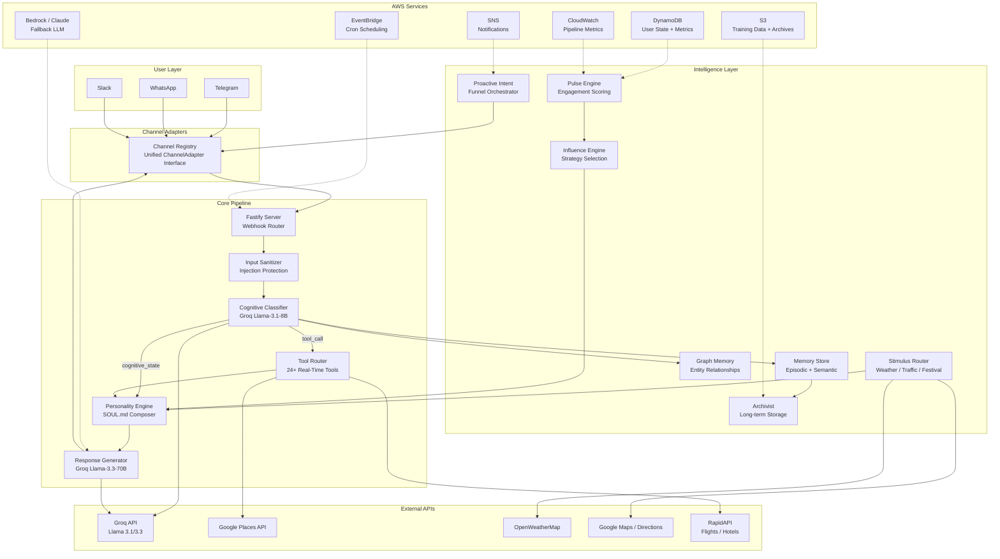
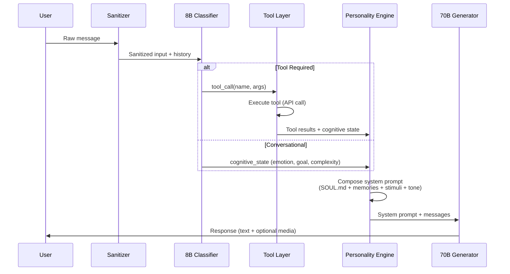
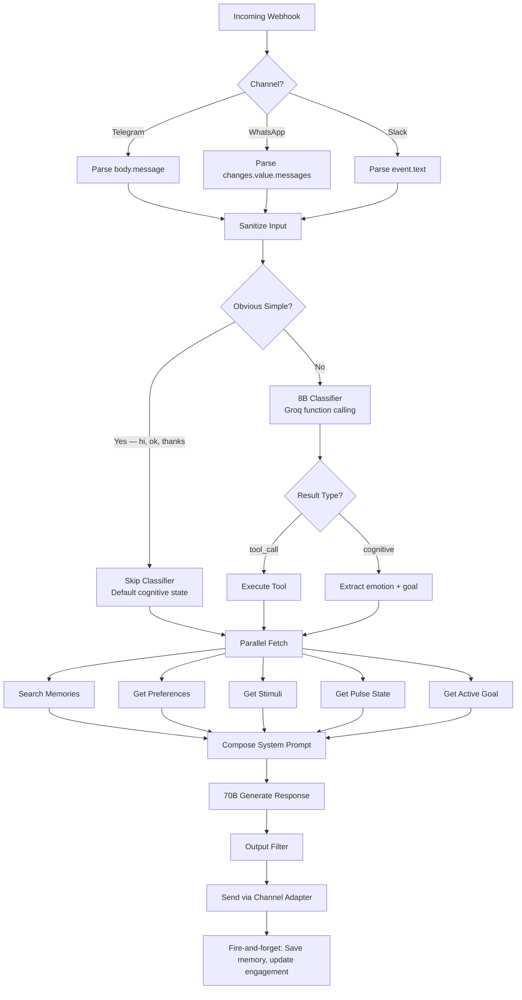

# System Architecture

## High-Level Architecture

## Dual-Model Pipeline

Aria uses a **classifier-gated dual-model pipeline** — the most critical architectural decision:

**Why two models?**
- **8B Classifier (~100ms):** Routes messages to tools or conversation. Extracts tool arguments via native function calling. Zero-cost for simple greetings.
- **70B Generator (~400ms):** Produces the final Aria-voice response using the full composed personality prompt. Only called once — never re-runs for tool routing.

## Request Lifecycle (Detailed)

