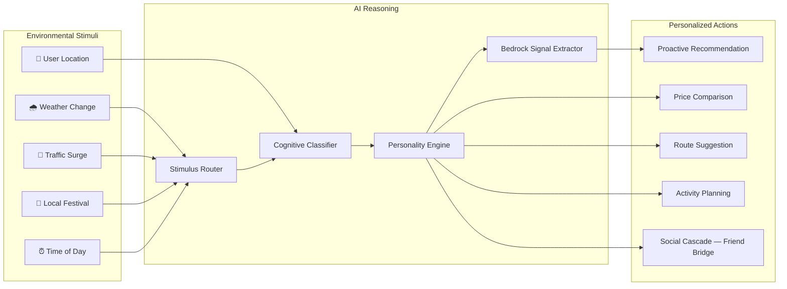
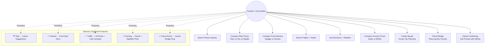

# Use-Case Diagram — Stimulus-Based AI Agent

## Core Concept: Stimulus → Reasoning → Action

The **stimulus-based AI agent** paradigm is the defining innovation. Instead of passively waiting for queries, Aria senses environmental signals, runs them through AI reasoning, and proactively delivers personalized actions.



## Travel Use Cases (Primary)



## Cross-Domain Expandability

The stimulus-based agent pattern is inherently **domain-agnostic**. The core pipeline (sense → classify → reason → act → learn) transfers to any domain where environmental signals influence decisions:

```mermaid
graph TB
    subgraph Core Engine — Reusable
        SE[Stimulus Engine]
        CR[Cognitive Classifier]
        PE[Personality + Memory]
        PU[Pulse Engagement]
        SO[Social Graph]
    end

    subgraph 🌾 Agriculture
        AG1[Soil Moisture Sensor] --> SE
        AG2[Weather Forecast] --> SE
        AG3[Market Price Feed] --> SE
        SE --> AGR1[Irrigation Alert]
        SE --> AGR2[Pest Warning + Treatment]
        SE --> AGR3[Optimal Sell Window]
    end

    subgraph 🏥 Healthcare
        HC1[AQI Monitor] --> SE
        HC2[Pollen Index] --> SE
        HC3[Patient Vitals Wearable] --> SE
        SE --> HCR1[Exercise Advisory]
        SE --> HCR2[Medication Reminder]
        SE --> HCR3[Caregiver Alert]
    end

    subgraph 📚 Education
        ED1[Study Duration Tracker] --> SE
        ED2[Exam Schedule] --> SE
        ED3[Performance Analytics] --> SE
        SE --> EDR1[Break Reminder]
        SE --> EDR2[Weak Topic Drill]
        SE --> EDR3[Study Group Bridge]
    end
```

> **Key Takeaway for Evaluators:** The stimulus engine, cognitive classifier, personality composer, pulse engagement, and social graph are **reusable components** (~70% of the codebase). Swapping the tool layer and stimulus sources allows the same architecture to power agents in agriculture (soil + weather + market stimuli), healthcare (AQI + vitals + medication stimuli), and education (study patterns + exam schedule stimuli) — with minimal changes to the core pipeline.
