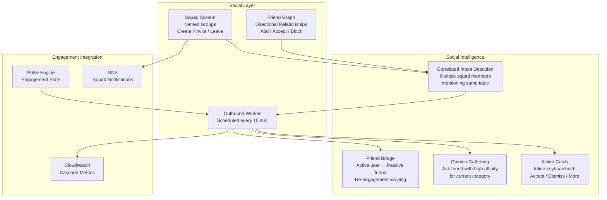
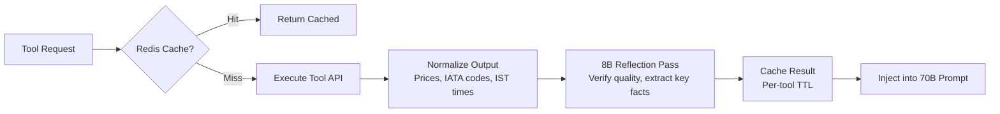
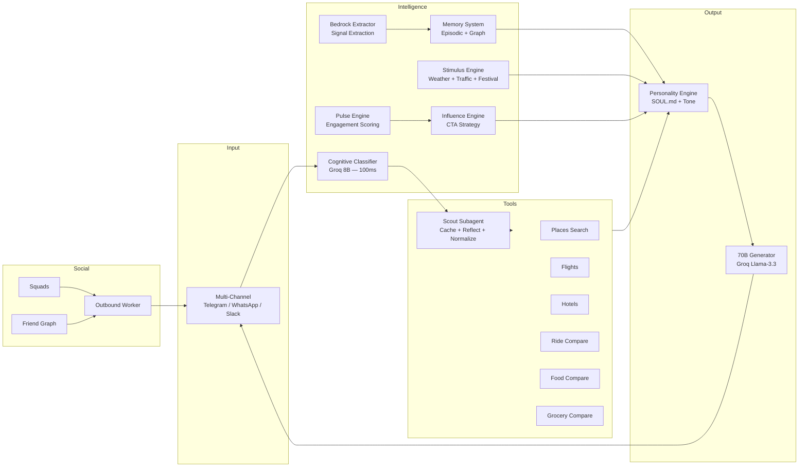

# Features

## Feature Overview

| # | Feature | Description | Status |
|---|---------|-------------|--------|
| 1 | **Stimulus Engine** | Real-time weather, traffic, and festival sensing with priority-ranked actions | ✅ Live |
| 2 | **Cognitive Classifier** | 8B LLM classifies intent and routes to tools in ~100ms | ✅ Live |
| 3 | **24+ Real-Time Tools** | Flights, hotels, places, rides, food, grocery — all with live data | ✅ Live |
| 4 | **Dynamic Personality** | SOUL.md-based persona that adapts tone to user emotion | ✅ Live |
| 5 | **Memory System** | Episodic + semantic + graph memory across conversations | ✅ Live |
| 6 | **Pulse Engagement** | 4-state engagement scoring (Passive → Curious → Engaged → Proactive) | ✅ Live |
| 7 | **Proactive Intent Funnels** | Multi-step guided journeys triggered by stimuli or engagement state | ✅ Live |
| 8 | **Influence Engine** | Context-aware CTA strategy based on engagement state + active topics | ✅ Live |
| 9 | **Social — Squads** | Named friend groups for coordinated recommendations and group planning | ✅ Live |
| 10 | **Social — Friend Graph** | Directional friendships with affinity scoring for opinion gathering | ✅ Live |
| 11 | **Social — Cascade Bridge** | Active-inactive friend bridge: re-engages passive friends via active ones | ✅ Live |
| 12 | **Scout Subagent** | Data fetcher with Redis caching, 8B reflection pass, and normalization | ✅ Live |
| 13 | **Bedrock Signal Extraction** | Claude Haiku extracts urgency, desire, rejection, preferences per turn | ✅ Live |
| 14 | **Archivist** | Long-term memory archival with Bedrock summarization and S3 storage | ✅ Live |
| 15 | **Price Comparison** | Cross-platform comparison: Uber/Ola/Rapido, Swiggy/Zomato, Zepto/Blinkit | ✅ Live |
| 16 | **Multi-Channel** | Telegram, WhatsApp, Slack via unified adapter interface | ✅ Live |
| 17 | **AWS Integration** | DynamoDB, Bedrock, S3, CloudWatch, SNS, EventBridge | ✅ Live |
| 18 | **Security** | Multi-layer prompt injection protection + output filtering | ✅ Live |

## Social Features Architecture

**How Social Cascade Works:**
1. User B (ENGAGED) is browsing restaurants in Jubilee Hills
2. Aria checks friend graph — User A (PASSIVE) has high affinity for food in that area
3. Aria sends User B: *"Your friend Priya loves South Indian food here — want to ping her?"*
4. User B taps "Ping Priya" → Aria sends User A: *"Aditya is exploring dinner spots near you — want to join the plan?"*
5. Both users re-engage → CloudWatch records a `CascadeTriggerCount` metric

## Scout Subagent Pipeline

## Feature Architecture Diagram

## Tool Capabilities

| Tool | Data Source | Capability |
|------|-----------|------------|
| `search_places` | Google Places API | Nearby restaurants, cafes, attractions with photos and ratings |
| `search_flights` | RapidAPI / Travel MCP | Real-time flight prices with dates and airlines |
| `search_hotels` | RapidAPI / Travel MCP | Hotel availability, pricing, and ratings |
| `compare_ride_prices` | Web Scrapers | Side-by-side Uber vs Ola vs Rapido pricing |
| `compare_food_prices` | Swiggy/Zomato MCP | Restaurant menu comparison across delivery platforms |
| `compare_grocery_prices` | Zepto/Blinkit MCP | Grocery item price comparison across platforms |
| `get_directions` | Google Maps API | Turn-by-turn directions with traffic-aware ETA |
| `get_weather` | OpenWeatherMap | Current conditions + multi-day forecast |
| `get_air_quality` | Air quality API | AQI, pollutants, health recommendations |
| `get_pollen` | Pollen API | Pollen count and allergy advisories |
| `convert_currency` | Exchange rate API | Real-time currency conversion |
| `get_timezone` | Timezone API | Time zone differences for travel planning |
