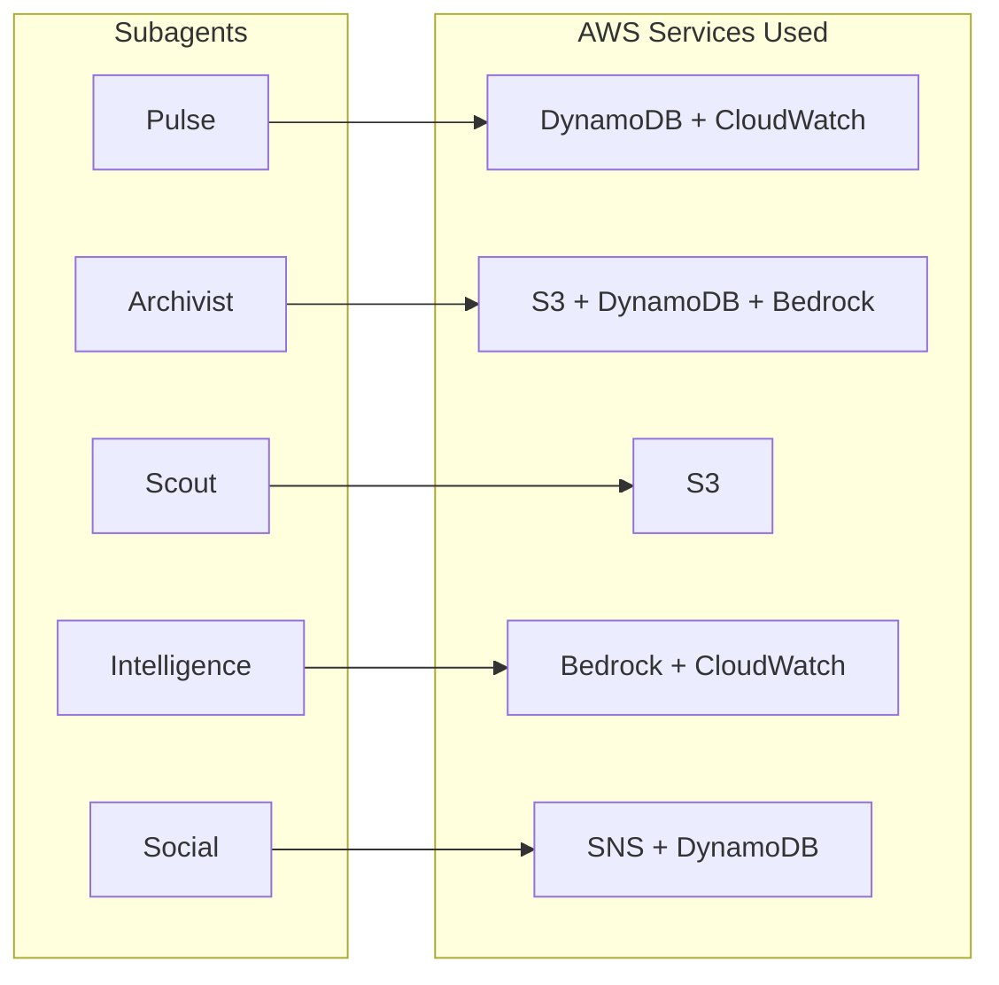

# AWS Services Utilized

## Service Map

```mermaid
graph TB
    subgraph Aria Core
        APP[Aria Application Server<br/>Fastify + Node.js]
    end

    subgraph AWS — Active Services
        BR[Amazon Bedrock<br/>Claude 3 Haiku<br/>Signal Extraction + Fallback LLM]
        DDB[Amazon DynamoDB<br/>User State + Engagement Metrics]
        S3[Amazon S3<br/>Training Data + Scout Archives]
        CW[Amazon CloudWatch<br/>Pipeline Metrics + Dashboard]
    end

    subgraph AWS — Provisioned, Activation-Ready
        SNS[Amazon SNS<br/>Squad Notifications<br/>Disabled: cost optimization]
        EB[Amazon EventBridge<br/>Cron Rule Scheduling<br/>Disabled: using local cron]
        EC[Amazon ElastiCache<br/>Redis Session Cache<br/>Disabled: using in-process cache]
        LM[AWS Lambda<br/>Proactive Job Runner<br/>Disabled: using local scheduler]
    end

    APP -->|Active| BR
    APP -->|Active| DDB
    APP -->|Active| S3
    APP -->|Active| CW
    APP -.->|Provisioned| SNS
    APP -.->|Provisioned| EB
    APP -.->|Provisioned| EC
    APP -.->|Provisioned| LM
```

> **Why some services are provisioned but not active:** Client factories, configurations, and IAM policies are fully implemented for all 8 AWS services. Services like SNS, EventBridge, Lambda, and ElastiCache are **intentionally disabled in the prototype** to minimize AWS billing during development and evaluation. Each can be activated by setting a single environment variable — no code changes required. This demonstrates production-readiness while keeping operational costs near zero.

## Active Services — Currently Running

### Amazon Bedrock (Claude 3 Haiku)
| Attribute | Value |
|-----------|-------|
| **Purpose** | (1) Signal extraction — extracts urgency, desire, rejection, preferences from every conversation turn. (2) Fallback LLM when Groq is rate-limited. |
| **Model** | `anthropic.claude-3-haiku-20240307-v1:0` |
| **Region** | `ap-south-1` |
| **Used By** | Intelligence subagent (`bedrock-extractor.ts`), Archivist subagent (`bedrock-summarizer.ts`), LLM tier manager (fallback) |

**Why Bedrock and not just Groq?** Bedrock Claude serves two distinct roles:
- **Signal Extraction:** Claude Haiku extracts structured JSON signals (urgency score, rejected entities, preferred entities) with higher accuracy than the 8B classifier. These signals feed the rejection memory and engagement scoring — critical for the proactive loop.
- **LLM Failover:** When Groq returns 429 (rate limit) or 5xx errors, the tier manager transparently falls back to Bedrock Claude. The user never notices degradation.

### Amazon DynamoDB
| Attribute | Value |
|-----------|-------|
| **Purpose** | Sub-millisecond key-value store for engagement metrics and user state |
| **Tables** | `aria-user-state`, `aria-engagement-metrics` |
| **Access Pattern** | Point reads/writes by `userId` — single-digit ms latency |
| **Used By** | Pulse subagent (`dynamodb-store.ts`), Engagement metrics (`engagement-metrics.ts`) |

DynamoDB is the **hot-path data store** for the Pulse engine. Every user interaction triggers an engagement weight update — DynamoDB's <5ms write latency is essential for real-time scoring that feeds the Influence Engine's CTA strategy selection.

### Amazon S3
| Attribute | Value |
|-----------|-------|
| **Purpose** | Durable object storage for session archives and scout results |
| **Buckets** | `aria-training-data`, `aria-scout-results` |
| **Used By** | Archivist subagent (`s3-archive.ts`), Scout subagent (result caching) |

The Archivist summarizes conversation sessions using Bedrock and archives summaries + raw data to S3. This creates a **long-term memory layer** — even when PostgreSQL memory rows are pruned, S3 archives preserve the full conversation history for future retrieval and model fine-tuning.

### Amazon CloudWatch
| Attribute | Value |
|-----------|-------|
| **Purpose** | Operational metrics, dashboards, and alerting |
| **Namespace** | `Aria/ProactiveAgent` |
| **Key Metrics** | `ProactiveSendCount`, `StimulusHitRate`, `RejectionRate`, `BedrockLatencyMs`, `EngagementScoreDelta`, `CascadeTriggerCount` |
| **Used By** | All subagents via `publishMetric()` / `publishMetrics()` |

CloudWatch powers a real-time dashboard tracking:
- Proactive message delivery rates and user acceptance
- Stimulus hit/miss ratios per type (weather vs traffic vs festival)
- Bedrock invocation latencies for signal extraction
- Social cascade trigger counts (friend bridge re-engagements)
- Engagement score trends across user cohorts

## Provisioned Services — Ready to Activate

These services have **full client implementations** (`AwsClientFactory`), configuration schemas (`aws-config.ts`), and IAM policies (`bedrock_iam_policy.json`) — but are intentionally disabled to conserve costs during prototype evaluation.

### Amazon SNS (Provisioned)
| Attribute | Value |
|-----------|-------|
| **Purpose** | Push notifications for squad group actions and system alerts |
| **Topics** | `aria-squad-notifications`, `aria-system-alerts` |
| **Activation** | Set `AWS_SNS_SQUAD_TOPIC_ARN` in `.env` |
| **Why Disabled** | Squad notifications currently use direct Telegram API calls. SNS adds multi-channel fan-out (email, SMS, mobile push) which isn't needed for the current prototype scope. |

### Amazon EventBridge (Provisioned)
| Attribute | Value |
|-----------|-------|
| **Purpose** | Scheduled cron rules for stimulus refresh and proactive outbound |
| **Activation** | Set `AWS_EVENTBRIDGE_RULE_ARN` in `.env` |
| **Why Disabled** | Aria uses a local Node.js cron scheduler (`scheduler.ts`) for the prototype. EventBridge + Lambda is the production path for serverless, fault-tolerant scheduling. |

### Amazon ElastiCache / Redis (Provisioned)
| Attribute | Value |
|-----------|-------|
| **Purpose** | Distributed session cache and Scout result caching |
| **Activation** | Set `AWS_ELASTICACHE_ENDPOINT` in `.env` |
| **Why Disabled** | The prototype uses in-process `Map` caches. ElastiCache is the production path for multi-instance horizontal scaling. |

### AWS Lambda (Provisioned)
| Attribute | Value |
|-----------|-------|
| **Purpose** | Serverless execution of proactive jobs and heavy tool calls |
| **Activation** | Set `AWS_LAMBDA_PROACTIVE_ARN` in `.env` |
| **Why Disabled** | All jobs run in-process on the single Fastify server. Lambda is the production path for isolating tool execution from the main event loop. |

## Subagent Client Architecture

Each internal subagent gets its own scoped `AwsClientFactory` instance — **no shared global singletons**. This enables granular IAM permissions and independent resource lifecycle:



**Design Benefits:**
- **Isolation:** One subagent's DynamoDB connection pool never conflicts with another's
- **IAM Granularity:** Each factory can be scoped to least-privilege IAM policies in production
- **Lazy Init:** AWS SDK clients are only created on first use — zero cold-start cost for unused services
- **Graceful Fallback:** Every `get*()` method returns `null` when AWS is not configured — Aria runs fully offline with just PostgreSQL + Groq
