# Prototype Performance Report / Benchmarking

## Pipeline Latency Breakdown

The dual-model pipeline is optimized for **sub-second total response time** for conversational messages and **2-3 seconds** for tool-assisted lookups.

| Stage | Component | Latency | Notes |
|-------|-----------|---------|-------|
| 1 | Input Sanitization | <1ms | Regex-based, zero LLM cost |
| 2 | Obvious-Simple Check | <1ms | Regex bypass for "hi", "ok", "thanks" |
| 3 | 8B Classifier (Groq) | 50–150ms | `llama-3.1-8b-instant` with native function calling |
| 4 | Tool Execution | 200–2000ms | Varies by API: Places ~300ms, Flights ~1.5s |
| 5 | Parallel Context Fetch | 50–200ms | Memory + Preferences + Stimuli + Pulse (concurrent) |
| 6 | System Prompt Composition | <5ms | Pure function — zero API calls |
| 7 | 70B Response Generation | 300–600ms | `llama-3.3-70b-versatile` |
| 8 | Output Filtering | <2ms | Regex-based safety check |
| **Total (conversational)** | | **~500ms** | |
| **Total (with tool)** | | **~1.5–2.5s** | |

```mermaid
gantt
    title Pipeline Latency — Conversational Message
    dateFormat X
    axisFormat %L ms

    section Input
    Sanitize           :0, 1
    Simple Check       :1, 2

    section Classification
    8B Classifier      :2, 120

    section Context Fetch
    Memory Search      :120, 200
    Preferences        :120, 170
    Stimuli            :120, 190
    Pulse State        :120, 160

    section Response
    Prompt Compose     :200, 205
    70B Generate       :205, 650
    Output Filter      :650, 652
```

## Token Economy

| Component | Tokens per Request | Cost Model |
|-----------|-------------------|------------|
| 8B Classifier system prompt | ~250 tokens | Groq free tier |
| 8B Classifier response | ~50 tokens | Groq free tier |
| 70B System prompt (composed) | ~650 tokens | Groq free tier |
| 70B User context + history | ~400 tokens | Groq free tier |
| 70B Response | ~200 tokens | Groq free tier |
| **Total per message** | **~1,550 tokens** | **~$0.001** |

## Optimization Strategies Implemented

| Strategy | Impact | Implementation |
|----------|--------|----------------|
| **Obvious-Simple Bypass** | 30% of messages skip classifier entirely | Regex detects greetings, acknowledgements |
| **Parallel Context Fetch** | Reduces serial wait by ~250ms | `Promise.all` for memory + preferences + stimuli + pulse |
| **Tool Argument Coercion** | Prevents tool execution failures | Auto-casts string numbers from 8B to proper types |
| **Stimulus Caching** | Avoids redundant API calls | 35-min stale threshold with 30-min cron refresh |
| **Concurrent Stimulus Refresh** | O(N) instead of O(3N) | All 3 stimulus types per location refreshed in parallel |
| **LLM Tier Fallback** | Zero-downtime on rate limits | Groq → Bedrock Claude automatic failover |
| **Connection Pooling** | Reduces DynamoDB cold-start | Per-subagent `AwsClientFactory` with lazy initialization |
| **Batch CloudWatch Metrics** | Fewer API calls | Up to 1000 data points per `PutMetricData` request |

## Scalability Characteristics

| Dimension | Current | Scalable To |
|-----------|---------|-------------|
| Concurrent users | 50+ | 10,000+ (with Redis session layer) |
| Stimulus locations | 20 concurrent | 500+ (with SQS queue) |
| Tool API calls | In-process | Lambda-offloaded |
| Message throughput | ~100 msg/min | ~5,000 msg/min (with horizontal scaling) |
| Memory store | PostgreSQL | PostgreSQL + pgvector sharding |
| Engagement metrics | DynamoDB on-demand | DynamoDB provisioned with auto-scaling |
