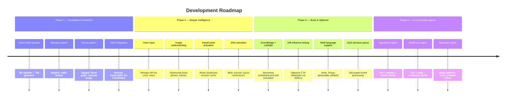

# Additional Details / Future Development

## Current Architecture Strengths

- **Modular Stimulus Engine** — New stimulus types (AQI, pollen, sports events) can be added by implementing a single function and registering it in the stimulus router.
- **Plugin-style Tool Layer** — Each tool is a standalone module with a schema definition. Adding a new tool requires no changes to the core pipeline.
- **Domain-Agnostic Core** — The cognitive classifier, personality engine, and engagement scoring are not travel-specific. They can power any stimulus-based agent.
- **Social Graph Ready** — Friend relationships, squads, opinion gathering, and social cascades are fully operational and can scale to larger user populations.
- **AWS Production Path** — All 8 AWS services are implemented at the code level. 4 are active, 4 are provisioned and can be activated with a single env var change — no code deploys needed.

## Planned Enhancements

## Provisioned AWS Services — Activation Plan

| Service | Current State | Production Trigger | Expected Impact |
|---------|--------------|-------------------|-----------------|
| **SNS** | Code complete, disabled | User count > 100, squad adoption | Multi-channel notifications (email, SMS, push) beyond Telegram-only |
| **EventBridge** | Code complete, disabled | Move to ECS/EKS deployment | Fault-tolerant, serverless cron — no missed stimulus refreshes |
| **ElastiCache** | Code complete, disabled | Multi-instance deployment | Sub-ms session reads, shared Scout cache across instances |
| **Lambda** | Code complete, disabled | Tool latency optimization | Isolate long-running tools (flights, scraping) from main event loop |

## Cross-Domain Expansion — Stimulus Agent Pattern

The core pipeline (stimulus → classify → reason → act → learn) transfers directly:

| Component | Travel (Current) | Agriculture | Healthcare |
|-----------|-----------------|-------------|------------|
| **Stimulus Sources** | Weather, traffic, festivals | Soil moisture, weather forecast, market prices, pest alerts | AQI, pollen count, patient vitals, medication schedules |
| **Cognitive Classifier** | Routes to 24 travel tools | Routes to irrigation, fertilizer, harvest, market tools | Routes to exercise, medication, diet, emergency tools |
| **Engagement Scoring** | Tracks food/activity/travel preferences | Tracks crop types, field sizes, farming patterns | Tracks health conditions, exercise habits, dietary needs |
| **Social Layer** | Squad trip planning, friend bridge | Farmer cooperatives, shared weather alerts | Family health groups, caregiver coordination |
| **Proactive Funnels** | "Rain detected → indoor café?" | "Frost warning → protect seedlings?" | "AQI spike → avoid outdoor exercise?" |
| **Signal Extraction** | Urgency, desire, rejection | Crop urgency, market timing, pest severity | Symptom urgency, medication compliance, diet rejection |

**Reusability:** ~70% of the codebase transfers directly. Only the tool layer and stimulus sources require replacement — the cognitive classifier, personality engine, memory system, social graph, pulse scoring, and influence engine are all domain-agnostic.

## Key Technical Decisions

1. **Per-subagent AWS factories** → Each component (Pulse, Archivist, Scout, Intelligence, Social) has its own client scope, enabling per-component IAM policies and independent resource limits in production.
2. **Lazy client initialization** → AWS SDK clients are only created on first use, keeping cold-start time minimal for serverless deployment. Unused services incur zero cost.
3. **Provisioned-but-disabled pattern** → All 8 AWS services have full implementations. 4 are active, 4 are disabled via empty env vars — not through code flags. This means activation requires zero code changes and zero redeployment.
