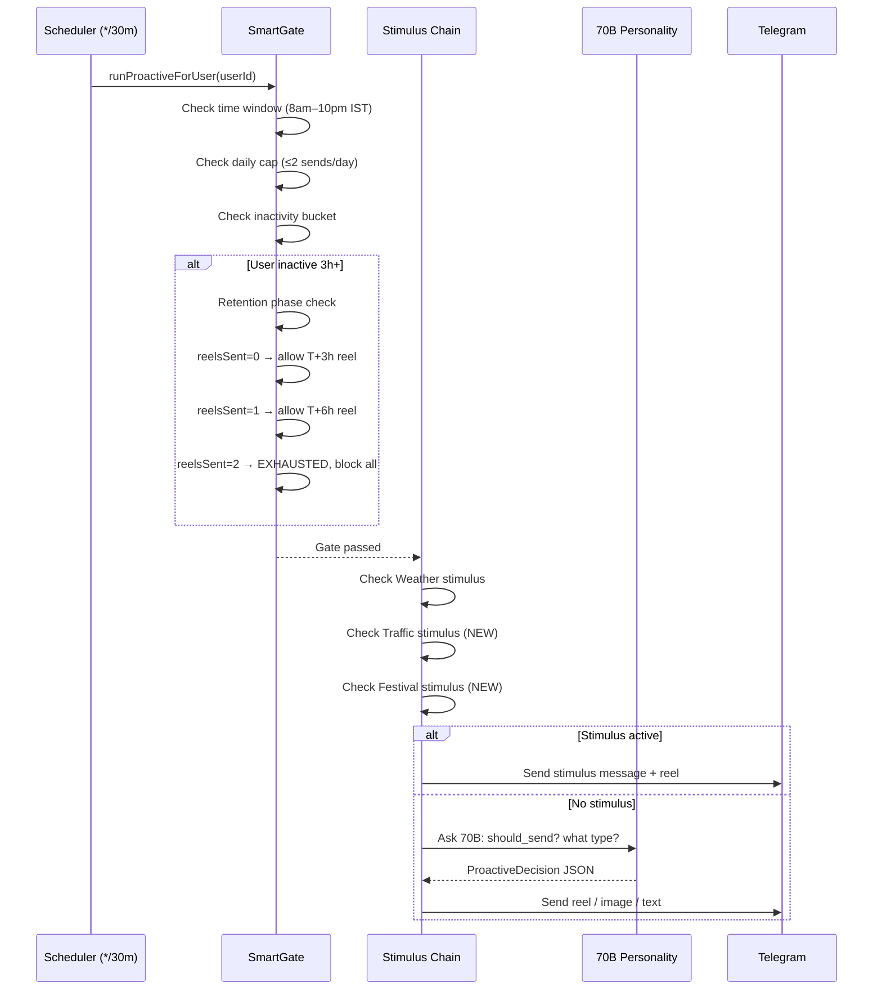
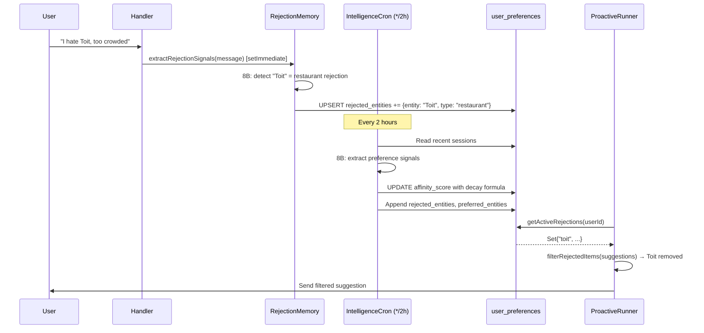

# Proactive Agent Architecture
> Implementation summary for issues #87–#93 | Built March 2026

---

## Goal Assessment

| Goal | Status |
|------|--------|
| Onboarding Engine (name, preferences, friends) | ✅ Built |
| Rejection Memory (block future bad suggestions) | ✅ Built |
| Intelligence Cron (affinity weight updater) | ✅ Built |
| Traffic Stimulus | ✅ Built |
| Festival Stimulus | ✅ Built |
| Inactive User Retention Caps (T+3h / T+6h) | ✅ Built |
| Social Communication Bridge (active-inactive) | ✅ Built |
| Opinion Gathering (friend with high affinity) | ✅ Built |
| AWS env scaffolding + .env.example | ✅ Built |
| DB schema migration (affinity, rejection, onboarding) | ✅ Built |
| Analytics recommendation notebook | ⏭️ Skipped (per user request) |

**9 / 10 items delivered. Vision substantially achieved.**

---

## What Was Built

### Phase 1 — Database & Preferences Foundation

**`database/migrations/002-proactive-agent-schema.sql`**
- Added `affinity_score`, `rejected_entities`, `preferred_entities` to `user_preferences`
- Added `onboarding_complete`, `onboarding_step`, `phone_number`, `proactive_opt_out`, `last_reel_sent_at`, `reel_count_phase` to `users`
- Added `retention_exhausted`, `retention_phase_start`, `retention_reels_sent` to `proactive_user_state`
- Created new tables: `intelligence_runs` (audit log), `stimulus_log` (traffic/festival/weather trail)

**`src/intelligence/rejection-memory.ts`**
- 8B LLM extracts explicit rejections/preferences from every user message (keyword pre-filter avoids unnecessary LLM calls)
- `getActiveRejections()` — cached read path used by proactiveRunner, influence-engine, Scout
- `filterRejectedItems()` — drop-in filter for any list of restaurants/places
- `persistRejectionSignals()` — JSONB append with dedup, fire-and-forget safe
- Wired into `handler.ts` Step 22 (real-time, `setImmediate`)

**`src/intelligence/intelligence-cron.ts`**
- Reads sessions from last N hours, extracts preference signals via 8B JSON mode
- Updates `affinity_score` with decay formula: `score = score * 0.9 + 0.05 + (delta * confidence)`
- Writes rejections/preferences to `user_preferences`
- Full audit trail in `intelligence_runs` table
- Registered in `scheduler.ts` — runs every 2 hours

### Phase 2 — Stimulus Expansion

**`src/stimulus/traffic-stimulus.ts`**
- Primary: Google Maps Distance Matrix API (measures real delay vs baseline on test routes)
- Fallback: Bengaluru time-of-day heuristic (weekday peak 7:30–10am, 5:30–9pm)
- Stimulus kinds: `HEAVY_TRAFFIC`, `MODERATE_TRAFFIC`, `CLEAR_TRAFFIC`
- Returns contextual message + hashtag for proactive send
- Registered in `scheduler.ts` — refreshes every 30 min

**`src/stimulus/festival-stimulus.ts`**
- Hardcoded Bengaluru festival calendar (15 events: Ugadi, Diwali, Onam, Dasara, Christmas, etc.)
- Optional Calendarific API integration via `FESTIVAL_API_KEY`
- Stimulus kinds: `FESTIVAL_DAY`, `FESTIVAL_EVE` (1 day before), `FESTIVAL_LEADUP` (3–5 days before)
- Each festival has curated activity/food suggestions for Bengaluru
- Registered in `scheduler.ts` — refreshes every 6 hours

**`src/media/proactiveRunner.ts` — Updated**
- **Stimulus priority enforced**: Weather → Traffic → Festival (weather has safety precedence)
- **Retention caps (Issue #93)**: T+3h inactive → send 1 reel; T+6h → send 1 final reel; then `retentionExhausted = true`, no more sends until user replies
- **Daily cap reduced** to 2 (from 5) per CLAUDE.md rules
- `updateUserActivity()` now resets retention phase counters on any user message
- Traffic and Festival stimulus functions added (`trySendTrafficStimulus`, `trySendFestivalStimulus`)

### Phase 3 — Social Features

**`src/onboarding/onboarding-flow.ts`**
- 5-step conversational funnel: `name → city → prefs_1 → prefs_2 → prefs_3 → friends → done`
- Preference questions use Telegram inline buttons (food type, budget tier, travel style)
- Friends step: shows existing Aria users as tappable list OR accepts `@username` / phone number
- Enforces minimum 1 friend (can skip with reminder)
- On completion: sets `onboarding_complete = TRUE`, `authenticated = TRUE`
- Integrated into `handler.ts` Step 2.5 — intercepts unauthenticated users before rate-limit check

**`src/social/friend-graph.ts` — Extended**
- Added `getActiveFriendsWithAffinity(userId, category, minAffinity)` — finds friends with high preference affinity for a given category
- Used by Opinion Gathering scenario

**`src/social/outbound-worker.ts` — Extended**
- **Active-Inactive Bridge** (`runFriendBridgeOutbound`): Scans ENGAGED/PROACTIVE users with warm topics; identifies PASSIVE friends; sends "Want to ping [friend]?" prompt with Telegram inline buttons
- **Bridge Ping Handler** (`handleBridgePingCallback`): Sends the passive friend a message with opt-in buttons; respects `proactive_opt_out`
- **Opinion Gathering** (`suggestFriendOpinion`): After tool execution (food/place search), suggests "ask [friend who knows this cuisine]" — fired from handler pipeline
- All bridge features respect 4h cooldowns and active-hours gate (9am–10pm IST)

### Infrastructure

**`src/scheduler.ts` — Updated**
- Added 5 new cron jobs: traffic refresh (*/30m), festival refresh (*/6h), intelligence cron (*/2h), friend bridge outbound (*/30m)

**`.env.example` — Updated**
- Added: `TRAFFIC_API_KEY`, `FESTIVAL_API_KEY`
- Added full AWS section: `AWS_ACCESS_KEY_ID`, `AWS_SECRET_ACCESS_KEY`, `AWS_BEDROCK_REGION`, `AWS_DYNAMODB_TABLE_USER_STATE`, `AWS_S3_TRAINING_BUCKET`, `AWS_S3_SCOUT_BUCKET`, `AWS_EVENTBRIDGE_RULE_ARN`, `AWS_SNS_SQUAD_TOPIC_ARN`

---

## Technical Architecture Diagram

```mermaid
graph TB
    %% ─── User Input Layer ───────────────────────────────────────────
    subgraph Channels["📱 Channels"]
        TG["Telegram Bot"]
        WA["WhatsApp Cloud API"]
        SL["Slack Events API"]
    end

    %% ─── Handler Pipeline ───────────────────────────────────────────
    subgraph Handler["🔄 Message Handler (handler.ts — 22 steps)"]
        S0["Step 0: /link /friend /squad commands"]
        S1["Step 1: Input Sanitization"]
        S2["Step 2: User Resolution"]
        S2_5["Step 2.5: ⭐ Onboarding Intercept"]
        S3["Step 3: Rate Limit"]
        S4["Step 4: Session Fetch"]
        S5["Step 5: 8B Classifier"]
        S6["Step 6: Memory Pipeline (5-way parallel)"]
        S8["Step 8: Tool Execution via Scout"]
        S9["Step 9: 8-Layer System Prompt"]
        S11["Step 11: 70B Personality LLM"]
        S13["Step 13: Output Filter"]
        S22["Step 22: ⭐ Rejection Signal Extraction"]
    end

    %% ─── Cognitive Layer ────────────────────────────────────────────
    subgraph Cognitive["🧠 Cognitive Layer"]
        CLS["8B Classifier (cognitive.ts)\nTool routing + emotion + goal"]
    end

    %% ─── Memory ─────────────────────────────────────────────────────
    subgraph Memory["💾 Memory Systems"]
        VM["Vector Memory (pgvector)"]
        GM["Graph Memory (entity relations)"]
        UP["User Preferences + Affinity Scores"]
        RM["⭐ Rejection Memory (rejection-memory.ts)"]
    end

    %% ─── Tools ──────────────────────────────────────────────────────
    subgraph Tools["🛠️ Tool Layer (20+ tools)"]
        SCOUT["Scout Wrapper\n(cache → execute → reflect → normalize)"]
        FLIGHTS["Flights / Hotels"]
        FOOD["Food / Grocery"]
        WEATHER_T["Weather / AQI"]
        RIDES["Ride Compare"]
        PLACES["Places / Directions"]
    end

    %% ─── Proactive System ───────────────────────────────────────────
    subgraph Proactive["📣 Proactive Engagement Engine"]
        direction TB
        GATE["computeSmartGate()\nDaily cap=2 | 8am–10pm IST\n⭐ Retention: T+3h → 1 reel, T+6h → final, then stop"]

        subgraph Stimuli["Stimulus Priority Chain"]
            WS["☁️ Weather Stimulus\n(RAIN_START, HEAT_WAVE, ...)"]
            TS["🚗 ⭐ Traffic Stimulus\n(HEAVY / MODERATE / CLEAR)"]
            FS["🎉 ⭐ Festival Stimulus\n(EVE / DAY / LEADUP)"]
        end

        TOPICS["Topic Follow-ups (Mode A)\nwarm topics > 4h ago"]
        CONTENT["Content Blast (Mode B)\nreelPipeline → Telegram"]
    end

    %% ─── Intelligence Layer ─────────────────────────────────────────
    subgraph Intelligence["🤖 ⭐ Intelligence Layer (NEW)"]
        IC["Intelligence Cron (*/2h)\nSession analysis → affinity_score updates\nRejection/preference extraction"]
        AFFINITY["Affinity Scores (0.0–1.0)\nDecay formula: score×0.9 + delta×confidence"]
    end

    %% ─── Social System ──────────────────────────────────────────────
    subgraph Social["👥 Social System"]
        FG["Friend Graph\nuser_relationships"]
        SQ["Squads\nsquad_members + intents"]
        OW["⭐ Outbound Worker\nSquad alerts (*/15m)"]
        BRIDGE["⭐ Friend Bridge (*/30m)\nActive → Inactive friend ping"]
        OPINION["⭐ Opinion Gathering\nHigh-affinity friend suggestion"]
    end

    %% ─── Onboarding ─────────────────────────────────────────────────
    subgraph Onboarding["🎯 ⭐ Onboarding Engine (NEW)"]
        OB_FLOW["5-Step Funnel\nname → city → food prefs →\nbudget → travel style → friends"]
        OB_FRIENDS["Friend Selection\nExisting users checklist\n+ @username / phone input"]
    end

    %% ─── Scheduler / Cron ───────────────────────────────────────────
    subgraph Scheduler["⏰ Scheduler (scheduler.ts)"]
        C1["Topic follow-ups (*/30m)"]
        C2["Content blast (*/2h)"]
        C3["Weather refresh (*/30m)"]
        C4["⭐ Traffic refresh (*/30m)"]
        C5["⭐ Festival refresh (*/6h)"]
        C6["⭐ Intelligence cron (*/2h)"]
        C7["⭐ Friend bridge (*/30m)"]
        C8["Social outbound (*/15m)"]
        C9["Memory queue (*/30s)"]
    end

    %% ─── Database ───────────────────────────────────────────────────
    subgraph DB["🗄️ PostgreSQL + pgvector (DigitalOcean)"]
        D1["users\n⭐ +onboarding_complete\n⭐ +phone_number\n⭐ +proactive_opt_out"]
        D2["user_preferences\n⭐ +affinity_score\n⭐ +rejected_entities\n⭐ +preferred_entities"]
        D3["memories (768-dim vectors)"]
        D4["proactive_user_state\n⭐ +retention_exhausted\n⭐ +retention_phase_start"]
        D5["⭐ intelligence_runs"]
        D6["⭐ stimulus_log"]
        D7["user_relationships / squads"]
        D8["sessions / topic_intents"]
    end

    %% ─── LLM ────────────────────────────────────────────────────────
    subgraph LLM["🤖 LLM Tier Manager"]
        G8B["Groq 8B-instant\nClassifier + Reflection + Intelligence"]
        G70B["Groq 70B-versatile\nPersonality + Proactive agent"]
        GEMINI["Gemini 2.0 Flash\n(fallback)"]
    end

    %% ─── Connections ────────────────────────────────────────────────
    Channels --> Handler
    S0 --> S1 --> S2 --> S2_5 --> S3 --> S4 --> S5 --> S6 --> S8 --> S9 --> S11 --> S13 --> S22

    S2_5 --> Onboarding
    S5 --> CLS
    S6 --> VM & GM & UP & RM
    S8 --> SCOUT --> Tools
    S9 --> G70B
    S11 --> G70B
    G70B -.fallback.-> GEMINI
    S22 --> RM

    Scheduler --> Proactive & Intelligence & Social
    C4 --> TS
    C5 --> FS
    C6 --> IC --> AFFINITY --> D2
    C7 --> BRIDGE

    GATE --> Stimuli
    WS --> CONTENT
    TS --> CONTENT
    FS --> CONTENT

    Social --> FG & SQ & OW & BRIDGE & OPINION
    FG --> D7
    BRIDGE --> FG
    OPINION --> FG

    Memory --> D2 & D3
    RM --> D2
    IC --> D5
    Proactive --> D4 & D6

    Handler --> DB
    LLM --> G8B & G70B

    %% ─── Styling ────────────────────────────────────────────────────
    classDef new fill:#d4edda,stroke:#28a745,color:#000
    classDef core fill:#cce5ff,stroke:#004085,color:#000
    classDef db fill:#fff3cd,stroke:#856404,color:#000
    classDef llm fill:#f8d7da,stroke:#721c24,color:#000

    class S2_5,S22,TS,FS,IC,AFFINITY,BRIDGE,OPINION,OB_FLOW,OB_FRIENDS,RM new
    class S0,S1,S2,S3,S4,S5,S6,S8,S9,S11,S13,GATE,SCOUT,TOPICS,CONTENT,FG,SQ,OW,CLS core
    class D1,D2,D3,D4,D5,D6,D7,D8 db
    class G8B,G70B,GEMINI llm
```

> **Legend:** 🟢 Green = newly built | 🔵 Blue = existing core | 🟡 Yellow = database | 🔴 Red = LLM

---

## Data Flow: Proactive Send Decision

---

## Data Flow: Intelligence Learning Loop

---

## New Files Created

| File | Purpose |
|------|---------|
| `database/migrations/002-proactive-agent-schema.sql` | Schema: affinity, rejection, onboarding, retention, stimulus log |
| `src/intelligence/rejection-memory.ts` | Real-time rejection detection + filtering |
| `src/intelligence/intelligence-cron.ts` | Background preference weight updater |
| `src/stimulus/traffic-stimulus.ts` | Traffic API + heuristic stimulus engine |
| `src/stimulus/festival-stimulus.ts` | Bengaluru festival calendar + Calendarific API |
| `src/onboarding/onboarding-flow.ts` | 5-step first-time user funnel |
| `analytics/data_export.py` | DB → CSV export for recommendation notebook |
| `analytics/requirements.txt` | Python deps for analytics |
| `CLAUDE.md` | Full agent instructions for any coding agent |

## Modified Files

| File | Change |
|------|--------|
| `src/media/proactiveRunner.ts` | +Traffic/Festival stimuli, +Retention caps, +Stimulus priority chain |
| `src/character/handler.ts` | +Onboarding intercept (Step 2.5), +Rejection extraction (Step 22) |
| `src/social/friend-graph.ts` | +`getActiveFriendsWithAffinity()` |
| `src/social/outbound-worker.ts` | +Active-Inactive Bridge, +Opinion Gathering, +handleBridgePingCallback |
| `src/scheduler.ts` | +4 new cron jobs (traffic, festival, intelligence, friend-bridge) |
| `.env.example` | +Traffic API, Festival API, full AWS service keys |
